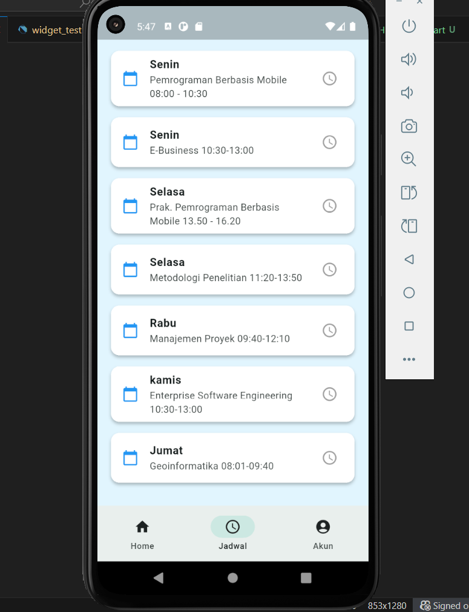
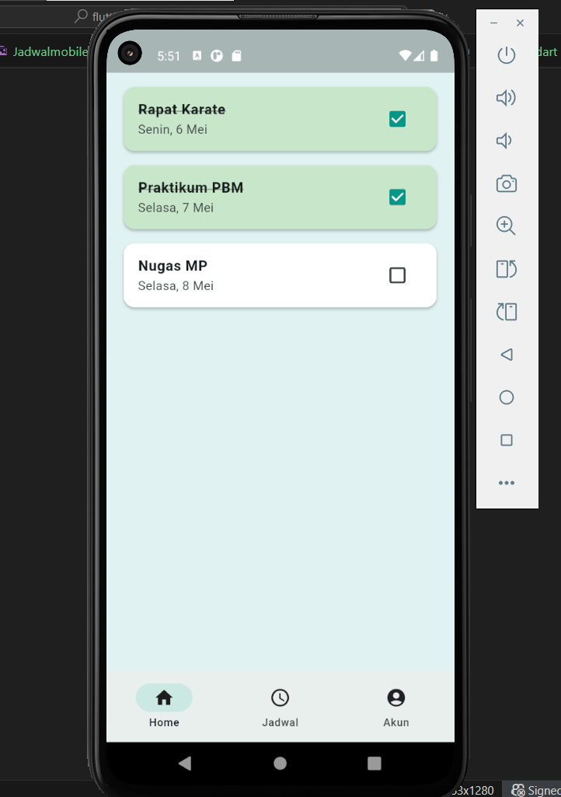
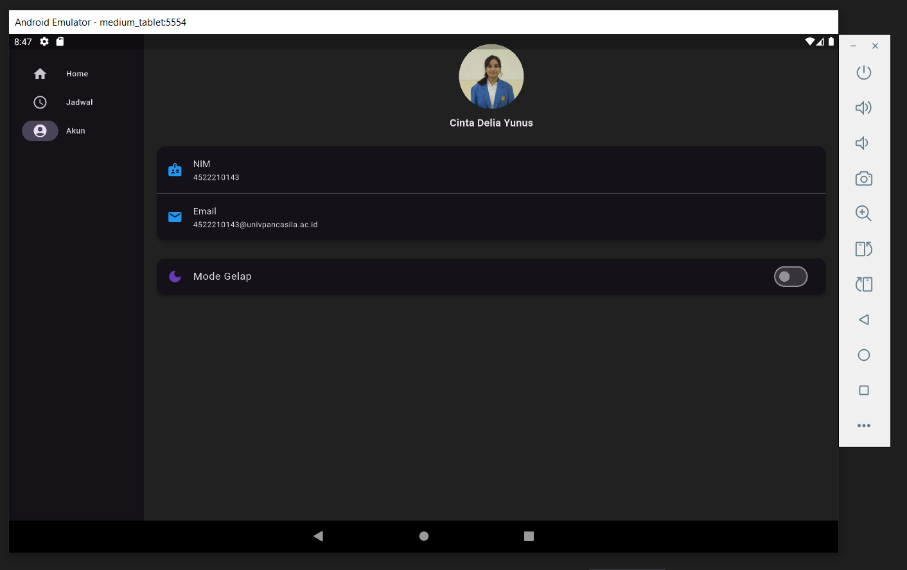
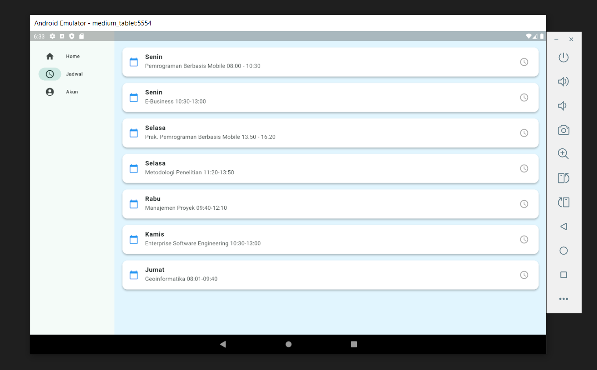
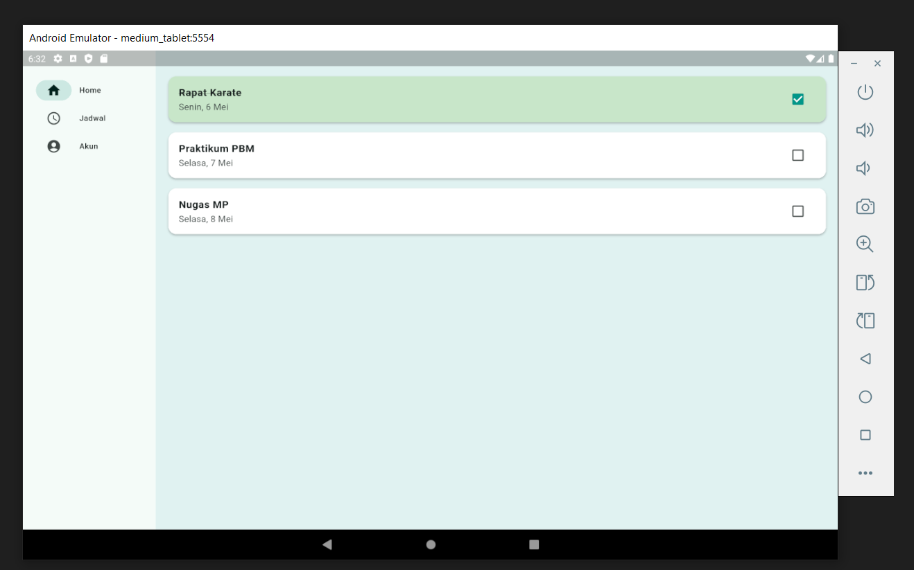
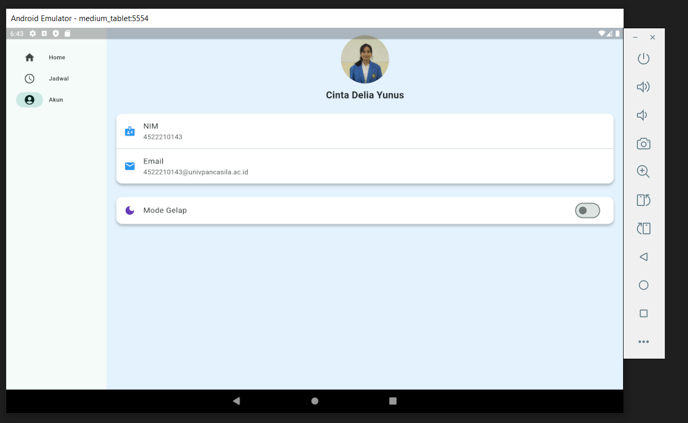

# flutter_uts_aplikasi_adwal_kuliah_dan_kegiatan_mahasiswa_adapatif
# Nama:
Cinta Delia Yunus, NPM 4522210143

## Deskripsi
aplikasi ini menampilkan tiga fitur utama: Home untuk daftar kegiatan, Jadwal untuk tampilan jadwal kuliah mingguan, dan Akun untuk data profil serta pengaturan tema terang/gelap.
Aplikasi menggunakan Flutter dengan layout responsif dari flutter_adaptive_scaffold, serta navigasi bawah (Bottom Navigation Bar) yang memudahkan pengguna berpindah antar halaman.

## Fitur Aplikasi
- Halaman Halaman Home: Menampilkan daftar kegiatan.
- Halaman Jadwal: Menampilkan jadwal kuliah mingguan.
- Halaman Akun: Menampilkan profil pengguna dan pengaturan tema (light/dark mode).
- Navigasi: Menggunakan BottomNavigationBar.
- Layout responsif: Menggunakan `flutter_adaptive_scaffold`.

## Struktur Proyek
Repositori ini memiliki struktur standar proyek Flutter, yang mencakup:
- lib/: Direktori utama untuk kode sumber Dart.
- android/, ios/, web/, windows/, macos/, linux/: Direktori platform-spesifik untuk mendukung berbagai sistem operasi.
- assets/: Tempat penyimpanan aset seperti gambar dan ikon.
- pubspec.yaml: Berisi informasi tentang dependensi dan konfigurasi proyek.

## Cara Menjalankan Aplikasi
Flutter pub get
Flutter run

## Screenshot emulator

